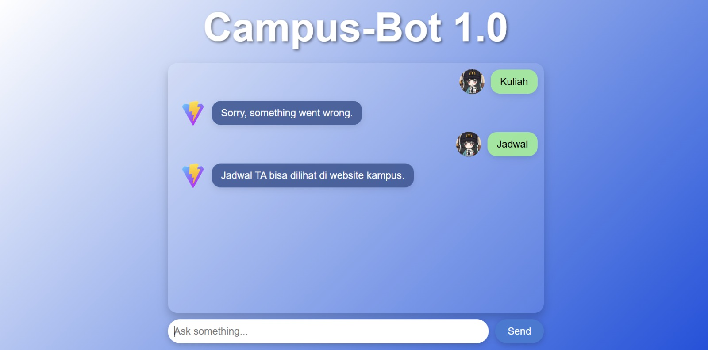

# 🎓 Campus-Bot 1.0

**Campus-Bot** is an NLP-based chatbot designed to answer questions related to campus and academic activities. The project combines a **TensorFlow/Keras text classification model**, **Flask REST API**, and **React frontend** to create an interactive chatbot application.

The chatbot processes user questions, performs text preprocessing and spelling correction, predicts the corresponding intent, and returns a predefined response based on the detected intent.

## 🚀 Project Overview

Campus-Bot was developed as a learning project to explore the integration of **Natural Language Processing (NLP)** and machine learning into a web application.

The application consists of two main components:

```text
React Frontend
      ↓
Flask REST API
      ↓
Text Preprocessing
      ↓
TensorFlow NLP Model
      ↓
Intent Classification
      ↓
Response Selection
      ↓
React Frontend
```

The system is designed around an **intent classification** approach rather than a generative AI model.

## 🎯 Objectives

The main objectives of this project are to:

* Explore fundamental NLP techniques.
* Build an intent classification chatbot.
* Apply text preprocessing and stemming.
* Implement basic spelling correction.
* Train and integrate a TensorFlow/Keras NLP model.
* Build a REST API using Flask.
* Connect a machine learning backend with a React frontend.
* Create an interactive chatbot interface.

## 🛠️ Tech Stack

### Backend

* **Python**
* **Flask**
* **TensorFlow / Keras**
* **NLTK**
* **NumPy**
* **Pandas / JSON**
* **Pickle**
* **Flask-CORS**

### Frontend

* **React**
* **JavaScript**
* **CSS**
* **Vite**

### Machine Learning / NLP

* Text preprocessing
* Tokenization
* TF-IDF representation
* Porter Stemming
* Levenshtein Distance
* Intent classification
* TensorFlow/Keras neural network

## 🧠 NLP Pipeline

When a user sends a question, the application processes it through several stages.

```text
User Question
      ↓
Remove Special Characters
      ↓
Tokenization
      ↓
Spelling Correction
      ↓
Stemming
      ↓
TF-IDF Representation
      ↓
TensorFlow Model
      ↓
Intent Prediction
      ↓
Intent Lookup
      ↓
Response Selection
      ↓
Bot Response
```

### 1. Text Cleaning

Special characters are removed while preserving letters, numbers, and spaces.

### 2. Tokenization

The question is separated into individual words using NLTK's `word_tokenize`.

### 3. Spelling Correction

The application uses a small predefined dictionary and **Levenshtein Distance** to identify words that are close to known terms.

For example, the system can attempt to correct minor spelling mistakes in campus-related terms.

### 4. Stemming

The corrected words are processed using the **Porter Stemmer** to reduce words to their stemmed forms.

### 5. TF-IDF Representation

The processed text is converted into a numerical representation using the trained tokenizer's TF-IDF representation.

```python
tokens = tokenizer.texts_to_matrix(
    [corrected_question],
    mode="tfidf"
)
```

### 6. Intent Classification

The TensorFlow/Keras model predicts the most likely intent from the processed question.

The predicted class is then converted back into an intent label using the stored encoder.

### 7. Response Selection

Once an intent is identified, the application searches the `Intents.json` file and randomly selects one of the available responses for that intent.

## 🤖 Chatbot Architecture

The project separates the user interface from the machine learning backend.

### Frontend

The React application provides:

* Chat interface
* User message input
* Send button
* Message history
* Loading indicator
* User and bot avatars

When a message is sent, React sends a `POST` request to the Flask server.

```text
React
  │
  │ POST /chat
  │ { "question": "..." }
  ↓
Flask API
  │
  ↓
NLP Processing
  │
  ↓
TensorFlow Model
  │
  ↓
Response
  │
  ↓
React
```

## 🔌 API

### `POST /chat`

The chatbot exposes a `/chat` endpoint that accepts a JSON request.

#### Request

```json
{
  "question": "How do I register for my thesis?"
}
```

#### Response

```json
{
  "response": "Example chatbot response",
  "corrected_input": "how do i register for my thesi"
}
```

The `response` contains the chatbot's answer, while `corrected_input` contains the processed version of the user's question.

## 📂 Project Structure

A recommended project structure is:

```text
Campus-Bot/
│
├── client/
│   ├── src/
│   │   ├── App.jsx
│   │   ├── App.css
│   │   └── ...
│   ├── public/
│   ├── package.json
│   └── vite.config.js
│
├── server/
│   ├── app.py
│   ├── Intents.json
│   ├── chatbot_model.h5
│   ├── tokenizer.pickle
│   ├── encoder.pickle
│   └── requirements.txt
│
└── README.md
```

## 📦 Installation

### Backend

Navigate to the server directory:

```bash
cd server
```

Create a virtual environment:

```bash
python -m venv venv
```

Activate it on Windows:

```bash
venv\Scripts\activate
```

Install the required dependencies:

```bash
pip install -r requirements.txt
```

Run the Flask server:

```bash
python app.py
```

The API will run locally on:

```text
http://localhost:5000
```

### Frontend

Navigate to the React application:

```bash
cd client
```

Install the dependencies:

```bash
npm install
```

Start the development server:

```bash
npm run dev
```

The React application will then be available through the local development URL provided by Vite.

## ⚙️ Model Files

The Flask backend requires the following trained model and preprocessing files:

```text
chatbot_model.h5
tokenizer.pickle
encoder.pickle
Intents.json
```

These files are used for:

| File               | Purpose                                              |
| ------------------ | ---------------------------------------------------- |
| `chatbot_model.h5` | Trained TensorFlow/Keras intent classification model |
| `tokenizer.pickle` | Saved tokenizer used to transform text               |
| `encoder.pickle`   | Converts model classes back into intent labels       |
| `Intents.json`     | Contains chatbot intents and possible responses      |

Make sure the paths to these files are configured correctly for the local environment.

## 📸 Screenshots

### Chat Interface

```markdown

```

## 📚 What I Learned

This project provided practical experience with:

* Natural Language Processing
* Text preprocessing
* Tokenization and stemming
* TF-IDF text representation
* Levenshtein Distance
* Intent classification
* TensorFlow/Keras model integration
* Flask REST API development
* React frontend development
* Frontend-backend communication
* CORS configuration
* Loading serialized machine learning models
* Building an interactive chatbot application

## 🔮 Future Improvements

Potential improvements include:

* Expand the intent dataset.
* Improve the spelling correction dictionary.
* Add more campus-related intents.
* Improve the NLP model architecture.
* Add confidence scores for predictions.
* Implement a fallback response for low-confidence predictions.
* Improve conversation context and multi-turn conversations.
* Add authentication if connected to university services.
* Replace predefined responses with a more flexible response generation system.
* Deploy the backend and frontend for public access.

## ⚠️ Project Limitations

Campus-Bot is an **educational NLP project** and has several limitations.

The chatbot uses intent classification and predefined responses, meaning it cannot freely generate answers to arbitrary questions.

Its performance also depends heavily on the intents and training data available during model development. Questions outside the supported intents may result in a generic fallback response.

The spelling correction system currently uses a relatively small predefined dictionary and may not correctly handle all spelling variations.

## 📌 Project Status

**Completed — Educational NLP / Full-Stack Prototype**

The current version demonstrates the integration of a TensorFlow-based NLP model with a Flask REST API and React frontend.

## 👤 Author

**Muhammad Rizky**

Computer Science Student
Universitas Mercu Buana

---

### ⭐ Project Focus

**Natural Language Processing · Machine Learning · TensorFlow · Flask · React · REST API · Python**
